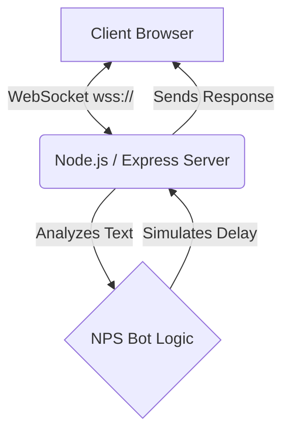

<div align="center">
  
  
  
  
  
  
  <h1>🚀 TalkSync - Intelligent Networking Chatbot</h1>
  <p>A real-time, bi-directional chat application featuring <b>NPS Bot</b> — an intelligent virtual assistant designed to teach you about Network Protocols.</p>
</div>

---

## 🌟 Overview
**TalkSync** brings real-time communication to life using WebSockets. Instead of a typical chatroom, it comes with a built-in virtual assistant named **Venkat Panth (NPS Bot)** who specializes in answering network and internet protocol-related questions!

With a striking **cyber-security-themed UI**, modern glassmorphism elements, and smooth interactive animations, TalkSync is both educational and beautiful.

## ✨ Key Features & Animations

### 🧠 Intelligent Bot Logic
- Pre-programmed with extensive knowledge on TCP, UDP, IP, DNS, HTTP/HTTPS, and the OSI Model.
- **Asynchronous Delays:** The bot simulates a natural "thinking" phase (3-5 seconds delay) before responding to you, giving it a human-like feel.

### 🎨 Stunning Animated UI (Glassmorphism)
- **Smooth Transitions:** Buttons feature `0.3s` background color transitions on hover.
- **Auto-Scroll Animation:** The chatbox automatically smoothly scrolls to the newest message whenever someone speaks.
- **Glassmorphism Aesthetic:** A frosted-glass (`backdrop-filter: blur(12px)`) chat container sitting on top of a dynamic cyber-themed background image.
- **Message Bubbles:** Client messages pop up in distinct blue bubbles (`#d1f7ff`) aligned to the right, while the bot responds in distinct orange bubbles (`#fff0cc`) aligned to the left.

## 🛠️ Technology Architecture



- **Backend Platform:** Node.js
- **Framework:** Express.js (serves static files from `/public`)
- **Real-Time Protocol:** WebSocket (`ws` module)
- **Frontend Stack:** HTML5, CSS3, Vanilla JavaScript

---

## 🚀 Installation & Setup

### 1. Prerequisites
Ensure you have [Node.js](https://nodejs.org/en/) installed on your system.

### 2. Clone the Repository
```bash
git clone https://github.com/karthikchowdary13/Chat-Application.git
cd Chat-Application/chat-websocket-app
```

### 3. Install Dependencies
This project uses lightweight packages. Install them using npm:
```bash
npm install
```
*(Dependencies: `express`, `ws`, `cors`, etc.)*

### 4. Start the Application
Run the backend Node.js server:
```bash
node server.js
```
You should see: `Server running at http://localhost:3000`

### 5. Access the Web App
Open your favorite modern web browser and navigate to:
**[http://localhost:3000](http://localhost:3000)**

---

## 🤖 Example Prompts to Try
Once inside the TalkSync interface, try typing these exact phrases to see how the bot reacts:
- *"What is TCP?"*
- *"Difference between TCP and UDP"*
- *"What is DNS?"*
- *"Explain the OSI model"*
- *"What is a port number?"*
- *"Hello"* or *"What is your name?"*

---

> **Note about Animations in this README:** 
> GitHub Markdown does not support active CSS/JS animations directly on the README page. If you'd like to show off the visual flair (like hover effects and auto-scroll) directly on GitHub, consider recording a short `.gif` or `.mp4` of the app in action and uploading it right below the title!

## 🤝 Contributing
Contributions, issues, and feature requests are highly welcome! Feel free to check the [issues page](https://github.com/karthikchowdary13/Chat-Application/issues) if you want to contribute.
